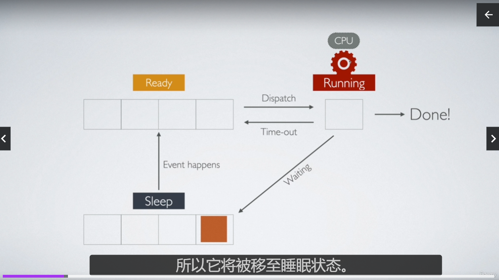
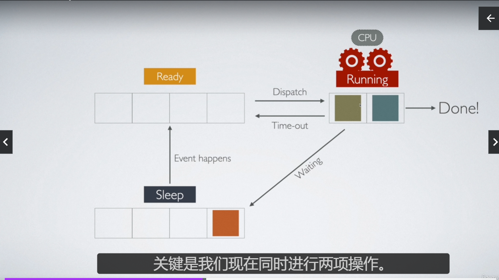
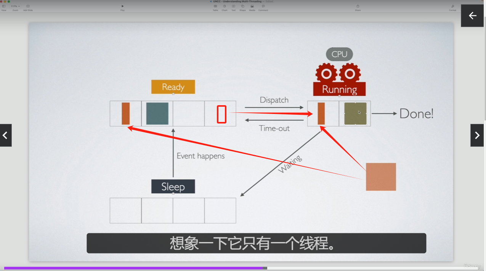

# 到底什么是线程

## CPU 时间(Time)

1. 定义：

CPU 时间是处理器实际用于执行特定程序或任务指令的时间。
它通常以极小的时间单位来衡量，如毫秒或微秒。

2. 时间片(Time Slice)：

在多任务操作系统中，CPU 时间通常被分割成小块，称为"时间片"。
每个运行中的进程或线程会被分配一个时间片来执行。

3. 调度：

操作系统的调度器负责分配这些 CPU 时间片。
它决定哪个进程或线程下一个获得 CPU 时间，以及获得多长时间。

4. 上下文切换：

当一个进程的时间片用完时，CPU 会保存当前的状态，切换到另一个进程。
这个过程称为上下文切换，它允许多个进程看似同时运行。

5. CPU 利用率：

CPU 时间的使用情况通常用 CPU 利用率来表示。
100%的 CPU 利用率意味着 CPU 在某个时间段内一直在工作，没有空闲。

6. 用户时间 vs 系统时间：

用户时间：CPU 执行用户程序代码所花费的时间。
系统时间：CPU 执行操作系统内核代码（如系统调用）所花费的时间。

7. 在 Node.js 中：

虽然 Node.js 主要是单线程的，但它的事件循环机制有效地利用了 CPU 时间。
异步操作允许 Node.js 在等待 I/O 时释放 CPU 时间给其他任务。

理解 CPU 时间对于优化程序性能很重要。在 Node.js 中，虽然我们通常不直接管理 CPU 时间，但了解这个概念有助于编写更高效的代码，特别是在处理计算密集型任务时。

## 线程状态

CPU 核心:CPU 核心是处理器中能够独立执行指令的处理单元。每个核心包含执行计算所需的基本组件，如算术逻辑单元(ALU)、控制单元和缓存。




1. 就绪(Ready)状态:

   在这个状态下,线程已经准备好运行,它拥有运行所需的所有资源,除了 CPU 时间。
   线程被放入就绪队列中,等待操作系统的**调度器分配 CPU 时间片**。
   多个就绪状态的线程可能同时存在,它们都在竞争 CPU 的使用权。

2. 运行(Running)状态:

   这是线程实际执行代码的状态。
   在单核处理器上,任何时刻只能有一个线程处于运行状态。
   在多核处理器上,可以有多个线程同时处于运行状态,每个核心运行一个线程。
   线程在运行状态会一直执行,直到它完成任务、自愿放弃 CPU、被更高优先级的线程抢占,或者进入阻塞状态。

3. Sleep || Blocked 状态:

   当线程无法继续执行当前的操作时,它会进入阻塞状态。
   常见的阻塞原因包括:等待 I/O 操作完成、等待某个资源变为可用、等待另一个线程的信号等。
   在阻塞状态,线程不会消耗 CPU 时间,但仍然占用内存和其他资源。
   当阻塞的条件满足时(如 I/O 操作完成),线程会重新进入就绪状态,等待被调度

### sleep 状态

Sleep 实际上是阻塞状态的一种特殊形式。当一个线程调用 sleep() 方法时:

1. 它会主动放弃 CPU,进入阻塞状态。
2. 线程会保持这种状态直到以下情况之一发生:
   - 指定的睡眠时间结束
   - 线程被中断(interrupt)
3. 睡眠结束后,线程并不会立即执行,而是会进入就绪状态,等待下一次被调度。

### 无 sleep 状态

主要情况包括：

1. CPU 密集型任务：

   执行大量计算，不需要等待外部资源。
   例如：复杂的数学计算、图形渲染、数据处理等。

2. 紧凑循环：

   没有 I/O 操作或其他可能导致阻塞的调用的循环。

3. 忙等待（Busy Waiting）：

程序通过持续检查某个条件来等待事件，而不是使用阻塞调用。

4. 实时系统中的关键任务：

   需要持续运行以快速响应事件的任务。

5. 某些类型的并发控制实现：

   如自旋锁（Spinlock），它会持续检查锁的状态而不是进入阻塞状态。

## CPU 参与和 Ready 状态的关系

CPU 参与和 Ready 状态的关系：

您完全正确，计算确实需要 CPU 的参与。
Ready 状态存在的原因与多任务处理系统的设计有关。

为什么会有 Ready 状态：
a) 多任务处理：

现代操作系统通常运行多个进程和线程。
CPU 核心数量通常少于活跃的线程数。

b) 时间片轮转：

操作系统使用时间片轮转算法来分配 CPU 时间。
每个线程运行一小段时间（时间片）后就会被切换出去。

c) 公平性：

Ready 状态确保所有线程都有机会获得 CPU 时间。
防止单个线程长时间占用 CPU。

d) 响应性：

允许高优先级任务快速获得 CPU 时间。

e) 资源管理：

帮助操作系统更好地管理和分配计算资源。

Ready 状态的作用：

它是线程等待被调度执行的队列。
线程在这里等待下一个可用的 CPU 时间片。

状态转换过程：

Running → Ready：当时间片用完或被高优先级任务抢占。
Ready → Running：当线程被调度器选中执行。

**举例**
假设我们有一个双核 CPU 和三个正在执行计算密集型任务的线程（A、B、C）：

```js
function heavyComputation(id) {
  console.log(`线程 ${id} 开始计算`);
  let result = 0;
  for (let i = 0; i < 1000000000; i++) {
    result += Math.sqrt(i);
  }
  console.log(`线程 ${id} 计算结束`);
  return result;
}

// 模拟三个并发的计算密集型任务
Promise.all([
  new Promise((resolve) => setTimeout(() => resolve(heavyComputation("A")), 0)),
  new Promise((resolve) => setTimeout(() => resolve(heavyComputation("B")), 0)),
  new Promise((resolve) => setTimeout(() => resolve(heavyComputation("C")), 0)),
]).then(() => console.log("所有计算完成"));
```

在这个场景中：

1. 初始状态：
   线程 A 和 B 在两个 CPU 核心上运行（Running 状态）。
   线程 C 在 Ready 状态，等待被调度。
2. 时间片结束：
   假设线程 A 的时间片用完。
   A 进入 Ready 状态，C 被调度到 Running 状态。
3. 持续轮转：
   操作系统会持续在 A、B、C 之间切换，给予它们执行的机会。
   在任何时刻，总有一个线程处于 Ready 状态。

Ready 状态的存在确保了：
所有线程都有公平的机会执行。
系统可以快速响应新的高优先级任务。
CPU 资源被有效利用，不会被单个任务独占。

## Context Switching

上下文切换是指操作系统保存当前运行任务（进程或线程）的状态，并恢复另一个任务的先前状态，使其能够从上次停止的地方继续执行的过程。

例如：在 I/O 操作完成的场景中，上下文切换主要做以下几件事：

1. 保存当前状态：
   保存当前正在执行的线程或进程的 CPU 寄存器状态。
   这包括程序计数器、堆栈指针、通用寄存器等。
2. 更新任务状态：
   将当前任务的状态从"运行"改变为"就绪"或其他适当的状态。
   将 I/O 完成的任务状态从"阻塞"改变为"就绪"。
3. 选择下一个任务：
   调度器选择下一个要执行的任务（在这个场景中，通常是处理 I/O 完成的任务）。
4. 加载新任务的状态：
   将选中任务的上下文信息加载到 CPU 寄存器中
   这包括恢复该任务的程序计数器、堆栈指针等
5. 切换内存映射
   如果需要，更新内存管理单元(MMU)以反映新任务的内存空间。

## 并发 concurrent 和并行 Parallel

1. 并发（Concurrent）：
   定义：并发是指多个任务在重叠的时间段内启动、运行和完成的能力。
   特点：
   不一定同时执行
   可以在单核 CPU 上实现
   涉及到任务的交替执行
   比喻：并发就像一个人同时玩多个手机游戏，通过不断切换来"同时"推进多个游戏。
2. 并行（Parallel）：
   定义：并行是指多个任务或多个任务的部分在同一时刻同时执行。
   真正的同时执行
   需要多核 CPU 或多台机器
   每个任务在不同的执行单元上运行
   比喻：并行就像多个人每人玩一个游戏，真正同时进行。
3. 关键区别：
   并发是关于结构，并行是关于执行
   并发可能导致并行，但并发不等于并行
   并行一定是并发，但并发不一定是并行
4. 在 Node.js 中的应用：
   并发：Node.js 的事件循环本质上是并发的，它允许多个异步操作交替进行。
   并行：通过 Worker Threads 或 Cluster 模块，Node.js 可以利用多核 CPU 实现真正的并行处理。
5. 选择并发还是并行：
   并发适合 I/O 密集型任务，如处理网络请求、文件操作等。
   并行适合 CPU 密集型任务，如大数据处理、复杂计算等。
6. 挑战：
   并发编程的挑战包括：资源共享、竞态条件、死锁等
   并行编程的挑战包括：任务分割、负载均衡、结果合并等。

## Thread 线程


A unit of execution,一个执行单元，启动一个程序会创建一个进程，这个进程至少有一个线程帮助其执行任务

**"So each thread is going to have its own program counter and also the operating system."**
这句话的意思是：

1. 每个线程都有自己的程序计数器（Program Counter）
2. 操作系统管理这些线程及其相关信息

让我们详细解释这两个部分：

1.  程序计数器（Program Counter）
    定义：程序计数器是 CPU 中的一个寄存器，用于指示当前正在执行的指令的内存地址。
    作用：它告诉 CPU 下一步要执行哪条指令。
    每个线程独有：每个线程都有自己的程序计数器，这允许线程独立执行，并在被中断后能够从正确的位置恢复执行。
2.  操作系统的角色：
    线程管理：操作系统负责创建、调度和管理所有的线程。
    上下文信息：操作系统为每个线程维护其完整的上下文信息，包括程序计数器的值。
    上下文切换：当线程切换时，操作系统负责保存当前线程的状态（包括程序计数器）并加载下一个线程的状态。

这个概念的重要性

- 并发执行：允许多个线程看似同时执行，即使在单核 CPU 上。
- 状态独立：每个线程可以独立执行，不会干扰其他线程的执行状态。
- 快速切换：操作系统可以在线程间快速切换，提高 CPU 利用率。
- 恢复执行：线程可以从被中断的确切位置恢复执行。

## 如何监控操作系统上的线程

## Spawning threads

```js
const { Worker } = require("worker_threads");
new Worker("./calc.js");
```

## 线程通信

### Node.js 中 Worker Threads 的工作原理和数据传递机制

```js
// 主线程
import { Worker } from "worker_threads";
const obj = { name: "name" };
new Worker("./calc.js", { workerData: obj });
console.log(obj);
```

```js
// Worker线程
import { Worker, workerData } from "worker_threads";
const obj = workerData;
obj.name = "Dylan";
console.log(obj);
```

#### workerData 经历了什么？

1. 数据克隆
   当创建新的 Worker 并传递 workerData 时，Node.js 会对这个数据进行结构化克隆（structured clone）。
   结构化克隆创建了一个深拷贝，而不是简单的引用传递。
2. 独立的数据副本:
   Worker 接收到的 workerData 是原始对象的一个完全独立的副本。
   这意味着 Worker 中对 obj 的修改不会影响主线程中的原始 obj
   每个 Worker 获得自己的数据副本，可以独立修改而不影响其他线程。
3. Worker 中的修改:
   在 Worker 线程中，obj.name 被修改为 "Dylan"。
   这个修改只影响 Worker 中的 obj 副本。
4. 主线程中的对象不变
   主线程中的 obj 保持不变，其 name 属性仍然是 "name"。
5. 性能考虑
   对于大型数据结构，克隆可能会带来性能开销。
   在这种情况下，可以考虑使用 SharedArrayBuffer 或消息传递来共享数据。

### workerData 与 postMessage 的区别

workerData 不是通过 postMessage 机制传递的。
workerData 是在创建 Worker 时直接传递的，作为 Worker 初始化的一部分

当你使用 new Worker(filename, { workerData: data }) 创建一个新的 Worker 时，workerData 是在 Worker 启动时就传递的。
这发生在 Worker 的脚本开始执行之前

- postMessage 和 onMessage：

postMessage 和 onMessage（在 Node.js 中是 worker.on('message', ...) 或 parentPort.on('message', ...)）是用于 Worker 创建后的持续通信。

### workerData 与 V8 序列化&反序列化

1. workerData 和 V8 序列化/反序列化:
   实际上，workerData 确实经历了一个序列化和反序列化的过程，但不是传统意义上的 V8 序列化。
   Node.js 使用了 V8 的 "Serialization API"，这是一个更底层、更高效的机制
2. V8 的 Serialization API
   个 API 使用了 "结构化克隆算法"（Structured Clone Algorithm）。
   它比传统的 JSON 序列化更强大，能处理循环引用、更多的数据类型等。
3. 序列化过程:

   当创建 Worker 并传递 workerData 时，数据会被序列化。
   这个序列化发生在 C++ 层面，使用 V8 的内部 API。

4. 反序列化过程:

   在 Worker 线程中，数据会被反序列化。
   这个过程也是在 C++ 层面自动完成的。

5. 代码层面的创建线程:

   在 JavaScript 代码层面创建 Worker 时，你不需要显式调用序列化方法。
   Node.js 在底层处理了所有的序列化和反序列化过程。

6. 性能考虑:

   这个过程比传统的 JSON.stringify/parse 更高效。
   但对于大量数据，仍可能有性能开销。

7. V8 的角色
   V8 提供了底层的 API 来实现这个过程。
   Node.js 利用这些 API 在 C++ 层面实现了数据传递。
8. 限制:
   某些类型（如函数、原型链、私有数据等）不能被序列化。
   传递这些类型会导致错误。
9. SharedArrayBuffer 的例外
   对于 SharedArrayBuffer，不会进行复制或序列化。
   它们是在线程间共享的

### transferList

```js
const { port1, port2 } = new MessageChannel();
const thread1 = new Worker("./calc.js", {
  workerData: { port: port1 },
  transferList: [port1],
});
const thread2 = new Worker("./calc.js", {
  workerData: { port: port2 },
  transferList: [port2],
});
// worker
const port = workerData.port;
port.postMessage("some text for testing");
port.on("message", (msg) => {
  console.log("Worker received:", msg);
});
const port = workerData.port;
port.postMessage("some text for testing");
port.on("message", (msg) => {
  console.log("Worker received:", msg);
});
```

1. transferList 的基本作用：
   它用于指定应该被转移（而不是复制）到新 Worker 线程的对象。
   这些对象的所有权会从当前线程转移到新的 Worker 线程。
2. 转移 vs. 复制：
   通常，传递给 Worker 的数据会被复制（通过结构化克隆）。
   使用 transferList，指定的对象会被转移，而不是复制。
3. 性能优势
   对于大型对象或缓冲区，转移比复制更高效。
   它避免了数据的复制，从而减少了内存使用和提高了性能
4. 支持的对象类型：
   主要用于 ArrayBuffer、MessagePort 和 FileHandle 类型的对象。
   在您的例子中，它用于转移 MessagePort 对象。
5. 所有权转移：
   一旦对象被转移，原线程将无法再使用该对象。
   对象的所有权和使用权完全转移到新的 Worker 线程
   ```js
   const thread1 = new Worker("./calc.js", {
     workerData: { port: port1 },
     transferList: [port1],
   });
   // port1 被转移到 thread1。
   //主线程不能再使用 port1。
   //thread1 获得了 port1 的完全控制权
   ```
6. 通信通道的建立：
   在这个场景中，transferList 用于创建 Worker 线程间的直接通信通道。
   每个 Worker 获得一个专用的 MessagePort，可以用于与其他 Worker 直接通信。
7. 安全性：
   转移确保了对象不会在多个线程间共享，避免了潜在的并发访问问题。
8. 使用注意事项：
   一旦对象被转移，在原线程中继续使用它会导致错误。
   确保在转移后不再在原线程中引用这些对象。

### Worker 的通信与 MessageChannel

```js
const thread1 = new Worker("./calc.js");
thread1.on("message", (msg) => {
  console.log("msg");
});
thread1.postMessage("message");
// worker
const port = parentPort;
port.postMessage("some text for testing");
port.on("message", (msg) => {
  console.log("Worker received:", msg);
});
```

1. 底层实现：
   虽然 Worker 的通信机制在概念上类似于 MessageChannel，但它们在底层实现上有所不同。
   Worker 的通信不是直接使用 MessageChannel 实现的，而是使用了更底层的机制。
2. Worker 通信机制：
   Node.js Worker Threads 使用了 V8 引擎提供的内部 API 来实现线程间通信。
   这个机制更接近于 Web Workers 的实现，而不是直接使用 MessageChannel。
3. 消息传递：
   Worker 线程和主线程之间的消息传递是通过 V8 的 PostMessage 机制实现的。
   这个机制在 C++ 层面处理消息的序列化和反序列化。
4. 事件驱动模型：
   Worker 实例实现了 Node.js 的 EventEmitter 接口。
   这就是为什么你可以使用 .on('message', ...) 来监听消息。
5. 与 MessageChannel 的比较：
   MessageChannel 提供了两个相连的 MessagePort 对象。
   Worker 通信更像是一个内置的、优化过的单向通道，连接主线程和 Worker 线程。
6. 内部工作流程：
   当调用 postMessage 时，消息被序列化。
   序列化的数据通过 V8 的内部机制传递给 Worker 线程。
   Worker 线程接收并反序列化消息，然后触发 'message' 事件。
7. 双向通信：
   Worker 实例和 Worker 线程内部都有 postMessage 和 on('message') 方法。
   这允许双向通信，而不需要显式设置两个通道。
8. 隐式的 MessagePort：
   虽然没有显式使用 MessagePort，但 Worker 的通信机制在概念上类似于一个隐式的、优化过的 MessagePort 对。

## CPU 密集型程序
